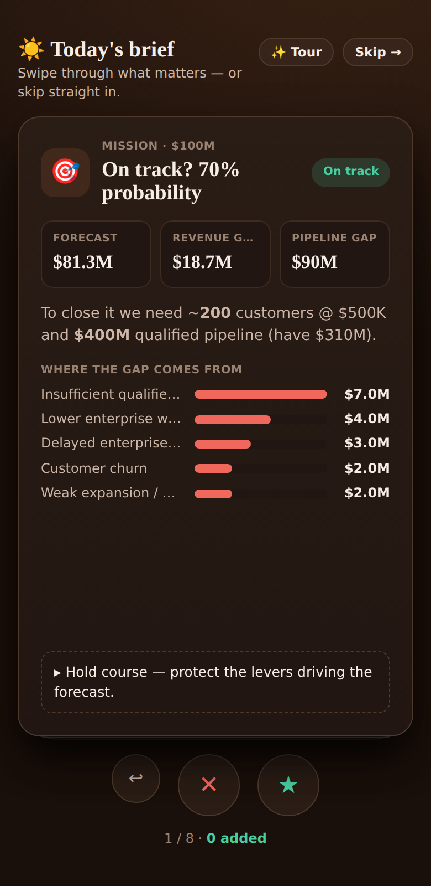
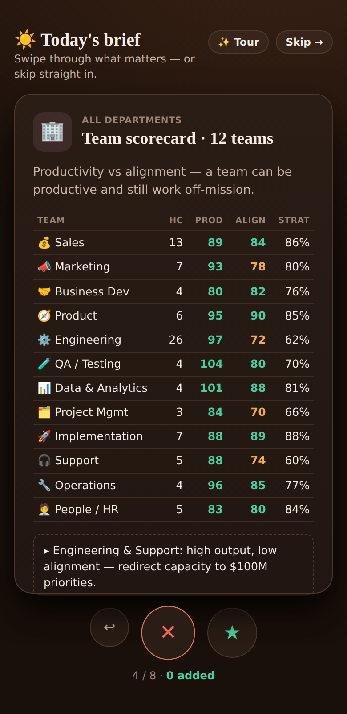
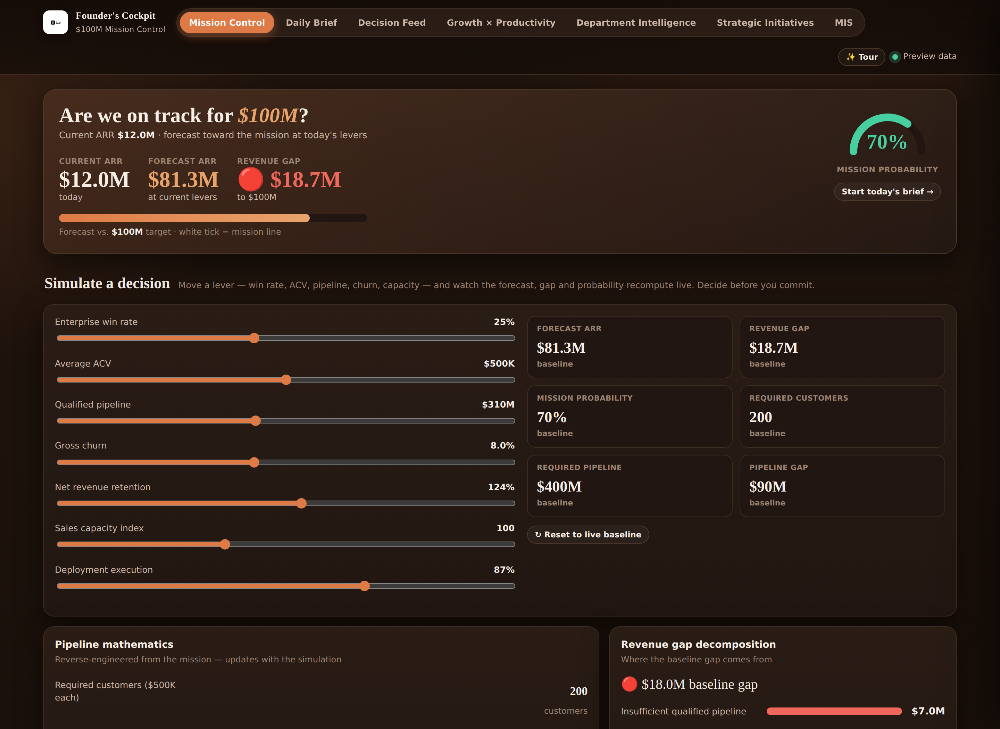
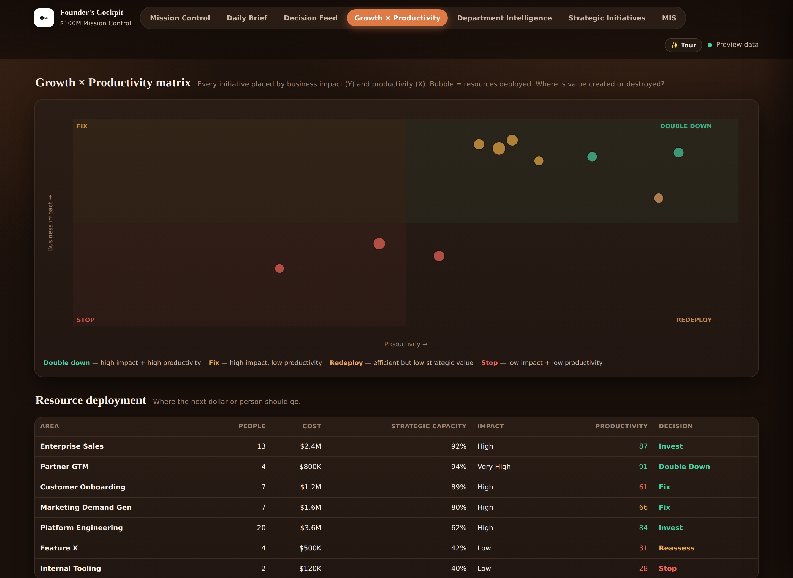
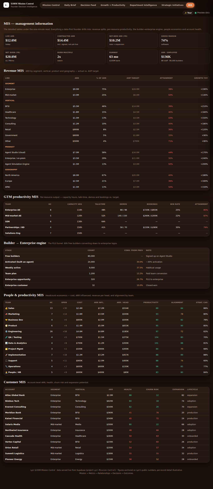

# Lyzr $100M Mission Control

> **Flagship: [`mission-control.html`](mission-control.html)** — a Founder Decision Intelligence system (Supabase-backed). `index.html` is the earlier self-contained brand dashboard.

Not another analytics dashboard — a **decision system**. One question drives everything: *are we on track for $100M, and if not, what should the founder do today?* Every metric ladders up to the mission (Mission → AOP → OKR → KPI → Initiative → Resource → Outcome).

**Live data:** reads from a dedicated **Supabase** project (`Lyzr-Mission-Control`) via read-only RLS. Deploy by importing this repo into Vercel (`vercel.json` routes `/` to `mission-control.html`).

## Screenshots

**1 · Daily news bites** — the Cockpit opens with a one-minute swipe brief (swipe right to add to today, left to skip), then lands in the dashboard:

 

**2 · Live $100M simulation** — move win rate, ACV, pipeline, churn or capacity and the forecast, revenue gap and mission probability recompute instantly:

**3 · Growth × Productivity matrix** — every initiative placed by business impact vs. productivity (double down / fix / redeploy / stop), plus where the next dollar or person should go:

**4 · MIS layer** — the detailed management tables under the one-minute read (revenue splits, per-resource GTM productivity, builder→enterprise funnel, people economics, account health):

### What's inside `mission-control.html`
- **News popup first** — a Bumble-style morning brief (6 essential cards) that opens on load; swipe right to add to today, or **Skip →** straight into the dashboard. Mobile-first.
- **Mission Control** — live `$100M` simulation: move win-rate / ACV / pipeline / churn / capacity and the forecast, revenue gap and mission probability recompute instantly. Plus pipeline math, gap decomposition, business-health scores, and the reverse funnel.
- **Decision Feed · Growth × Productivity matrix · Department Intelligence · Strategic Initiatives** — signals → decisions → did-it-work.
- **MIS** — the detailed management tables a data-first founder drills into: revenue by segment/vertical/product/geo, **per-resource GTM productivity** (capacity hrs, talk-time, demos, bookings vs target), the **80k builders → enterprise** PLG engine, people economics, and account health.
- **Onboarding tour** (skippable) for the CEO.
- **UAT:** 30/30 automated checks pass (all screens, interactions, mobile — no horizontal overflow, no JS errors).

### The CEO angle (built for how Siva thinks)
Lyzr began as *"Data Analyzr"* and Siva is an ex-Tesco data engineer — he thinks in data and MIS, tracks **Contracted ARR**, 95% gross margin, break-even, and the free-builder→enterprise funnel, under his *Organizational General Intelligence* thesis. The MIS layer and the contracted-ARR / builder-funnel / per-resource-productivity tables are built for exactly that.

---

## (Earlier deliverable) Lyzr Founders' Cockpit — `index.html`

A single, self-contained analytics dashboard — one HTML file, no build step, works offline.

Built in response to the brief: *"a dashboard with a news feed that tracks all internal metrics across marketing, sales, project management, etc. — simple for a founder to see, with in-depth access."*

---

## The thinking behind it

The founder doesn't have a data source yet, and he's screening for an **analytical brain** — someone who finds *relationships* between data points, not someone who just renders numbers. So this is built as two things at once:

1. **A working model today** — a coherent AI-SaaS scenario anchored on Lyzr's **real public figures**: **~$12M ARR** (Jun'26), **~32 enterprise customers** (~$250K ACV, largest ~$2M), **Accenture-backed** ($250M valuation, ~$100M Series B), **~88 staff + 172 open reqs**, pushing to **$100M ARR**. Every number ties to every other number. (The founder's brief said "assume $8M ARR / $10M burn" — the ⚙︎ Assumptions panel makes ARR/burn editable, so you can flip to his figures in one drag and show you cross-referenced the public numbers.)
2. **A data contract for tomorrow** — the same schema accepts real CSV / Google Sheets / product-API data and every view repopulates automatically.

Three layers, one toggle — exactly the "he sees one screen, then drills in" behaviour he described:

| View | Who it's for | What it answers |
|------|--------------|-----------------|
| **Founder View** | CXO, 10-second read | Revenue, burn, runway, the 5 board-level efficiency ratios, headcount health, and the 3 things that need him today |
| **Founder Brief** | CXO, one-minute read | A Bumble-style **swipe deck** — one department per card (what's happening, team size, productivity, impact, right-resources?, leader performance, EOP alignment, top performers, the big deal coming). **Swipe right to note, left to skip** — touch on mobile, drag or ←/→ keys on web. Ends with a summary of everything noted (persisted in the browser). |
| **Departments** | Any team lead | All 12 teams on one comparable framework, click-to-drill |
| **Correlation Engine** | The analyst | The *real* relationships — Pearson r computed live on 12 months of data |
| **Insight Feed** | Everyone | The dashboard telling you what changed and why — the "news feed" |

## Brand

Styled to match **lyzr.ai** — warm espresso background, terracotta accent, editorial serif headlines (Fraunces) over clean sans body (Inter), translucent pill controls, and the real Lyzr logo embedded. Fully **web + mobile responsive**; the Founder Brief is built mobile-first.

## Why the correlation engine matters

His LinkedIn post is explicit: *"run correlation models to identify the true relationships between data points, not just prompting GPT and Claude."* That's the whole test.

So the analytics layer computes **actual Pearson correlations** in-browser across 11 operating metrics (marketing spend, MQLs, SQLs, demos, talk-time, reps, bookings, new ARR, CAC, tickets, CSAT). The underlying sample series are constructed with *genuine* causal structure + noise — e.g. demos are driven by SQL volume *and* sales capacity, new ARR is driven by demos × win-rate, tickets scale with the customer base — so the correlations that surface are real, not decorative. The "What drives New ARR" ranking and the R² read-out are computed, not hard-coded.

## Headcount model (method, not vibes)

- **Recommended total heads = ARR ÷ target ARR/employee** (default $150K/FTE → ~80 heads right-sized for $12M).
- Allocated across 12 functions using SaaS benchmarks for a company scaling toward $100M (R&D ~40%, GTM ~27%, CS/Support ~14%, G&A ~9%).
- Each department shows **actual vs benchmark target vs open reqs** — so the real story is visible: current headcount (~88) is roughly right-sized for $12M, but **172 open reqs** are pre-building for $100M. The constraint isn't capital, it's **sequencing 172 hires against a 39-day time-to-hire and a 78% offer-acceptance rate**.

## Board-level efficiency ratios

Burn multiple · Rule of 40 · ARR/employee · Gross margin · NRR · CAC payback — the numbers a board actually reads when it sees "$8M ARR on $10M burn."

## Common productivity framework

Every one of the 12 teams (Sales, Marketing, BD, Product, Engineering, QA, Data, PM, Implementation, Support, Ops, HR) is measured on the same five steps so they're directly comparable:

**Capacity → Utilization → Output → Target vs Achievement → Efficiency index**

Then each team layers on its own bespoke output metrics (Sales: demos / talk-time / win-rate; Engineering: velocity / cycle time / uptime; Support: tickets / CSAT / resolution; etc.). Achievement is **direction-aware** — for "lower is better" metrics (time-to-value, time-to-hire, escape rate), beating target correctly reads as *over* 100%.

## Live assumptions

The ⚙︎ Assumptions panel exposes the four load-bearing levers — **ARR, net burn, target ARR/FTE, YoY growth** — and every ratio, chart, and headcount recommendation recomputes instantly. Drag ARR/FTE and watch each department's target move.

## Plugging in real data

Replace the `buildSeries()` output and the `DEPTS` snapshot with real values in the same shape. No other change needed — the schema *is* the contract.

---

*Model anchored on Lyzr's public figures (ARR, customers, funding, headcount). The monthly time-series and per-team operating detail are illustrative — plug in the real data through the same schema to make it live.*
